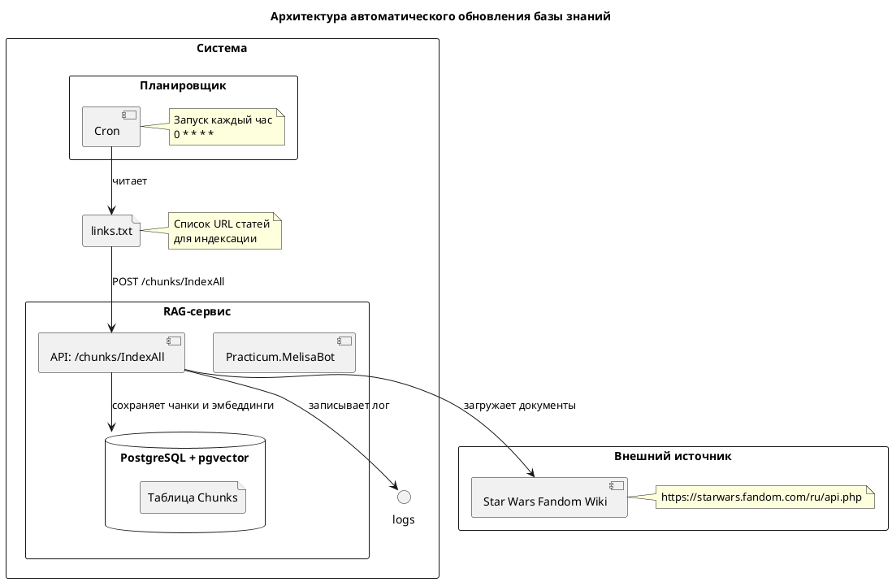

# Отчет по автоматизации ежедневного обновления базы знаний

---

## 1. Выбор источника данных

| Параметр | Значение |
|----------|----------|
| **Тип источника** | Wiki API (Star Wars Fandom) |
| **URL Wiki API** | `https://starwars.fandom.com/ru/api.php` |
| **Механизм получения данных** | Метод `IndexAll` сервиса Practicum.MelisaBot обращается к Wiki API и загружает документы |
| **Список ссылок** | Файл `/home/user/project/links.txt` содержит URL статей для индексации |

---

## 2. Скрипт обновления индекса

### 2.1 Файл: `install_cron.sh`

```bash
#!/usr/bin/env bash

set -euo pipefail

FILE_PATH="/home/user/project/links.txt"

CRON_JOB="0 * * * * curl -f -s -X POST -H 'Content-Type: text/plain' --data-binary \"@$FILE_PATH\" http://localhost:8080/chunks/IndexAll && rm \"$FILE_PATH\""

echo "Adding cron job..."

# Проверяем существует ли уже такая задача
if crontab -l 2>/dev/null | grep -F "$CRON_JOB" >/dev/null; then
    echo "Cron job already exists. Skipping."
    exit 0
fi

# Добавляем задачу
(
    crontab -l 2>/dev/null
    echo "$CRON_JOB"
) | crontab -

echo "Cron job successfully added."
```

### 2.2 Что делает скрипт

1. Проверяет наличие cron-задачи для обновления индекса
2. При отсутствии добавляет задачу в crontab
3. Cron-задача выполняется каждый час и:
   - Читает файл `/home/user/project/links.txt` со списком URL
   - Отправляет POST-запрос в API эндпоинт `/chunks/IndexAll`
   - При успешном выполнении удаляет файл `links.txt`

---

## 3. Настройка периодического запуска

### 3.1 Cron-задача

```
0 * * * * curl -f -s -X POST -H 'Content-Type: text/plain' --data-binary "@/home/user/project/links.txt" http://localhost:8080/chunks/IndexAll && rm "/home/user/project/links.txt"
```

### 3.2 Параметры запуска

| Параметр | Значение |
|----------|----------|
| **Периодичность** | Каждый час в 0 минут |
| **Планировщик** | Cron (Linux) |

### 3.3 Обработка ошибок

- При отсутствии файла `links.txt` curl завершится с ошибкой, файл не будет удален
- При неудачном запросе к API файл сохраняется для повторной попытки
- Файл удаляется только после успешного выполнения curl

---

## 4. Архитектурная диаграмма



---

## 5. Заключение

Реализовано полностью автоматизированное обновление базы знаний:

- **Источник данных**: Star Wars Fandom Wiki API
- **Список ссылок**: файл `/home/user/project/links.txt`
- **Скрипт установки**: `install_cron.sh` для настройки планировщика
- **Планировщик**: cron (каждый час в 0 минут)
- **Обработка**: метод `IndexAll` сервиса Practicum.MelisaBot
- **Логирование**: выполняется на стороне сервиса

Система готова к эксплуатации и обеспечивает регулярное обновление векторного индекса без ручного вмешательства.